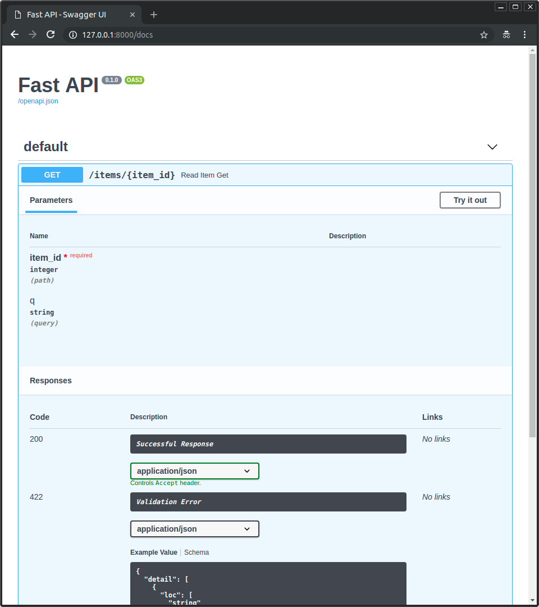
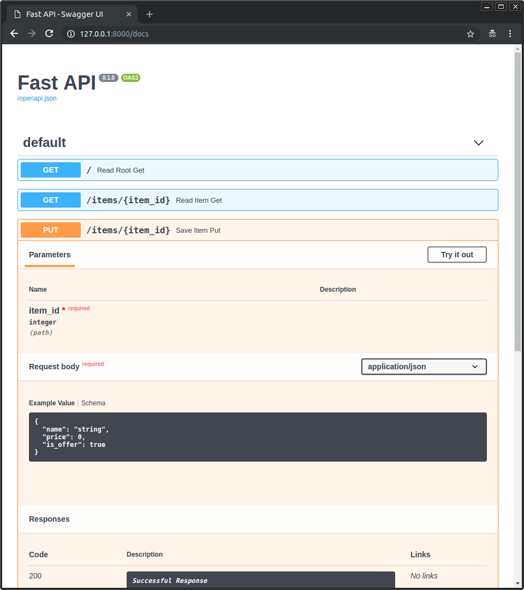

# FastAPI 简介


## 文档资源：

官网：[https://fastapi.tiangolo.com/](https://fastapi.tiangolo.com/)

中文官网：[https://fastapi.tiangolo.com/zh/](https://fastapi.tiangolo.com/zh/)

项目地址：[https://github.com/tiangolo/fastapi](https://github.com/tiangolo/fastapi)

---

## 简介：

FastAPI是一个用于构建API的现代、快速（高性能）的web框架，使用Python3.6+ 版本，并基于Python标准库（typing库）提供的类型提示（type hints）。

项目遵循 MIT 许可协议。


其关键特性包括：

- 快速：FastAPI基于[Starlette](https://www.starlette.io/)和[Pydantic](https://pydantic-docs.helpmanual.io/)，使其拥有了可以比肩NodeJS和Go的及高性能。是目前最快的Python web框架之一。

- 开发高效：提高功能开发速度约200% ~ 300%。

- 更少bug：减少约 40% 的开发者人为错误。

- 智能：极佳的编辑器支持。处处皆能自动补全，减少调试时间。

- 简单：易于使用和学习的设计，阅读文档的时间更短。

- 简短：代码重复最小化，通过不同的参数声明实现丰富功能，bug更少。

- 健壮：100% 测试覆盖率，代码库100% 类型注释，生产环境可用级别的代码。还可以自动生成交互式文档（[swagger](https://github.com/swagger-api/swagger-ui)文档和[ReDoc](https://github.com/Redocly/redoc)文档）。

- 标准化：基于（并完全兼容）API的相关开放标准：[OpenAPI](https://github.com/OAI/OpenAPI-Specification)（以前称为Swagger）和[JSON Schema](https://json-schema.org/)。


FastAPI目前已经被许多公司用于生产环境，其中包括微软、Uber、Netflix等。


> 特别说明：
> 1. 目前最快的Python web框架之一：参见[https://www.techempower.com/benchmarks/#section=data-r20&hw=cl&test=plaintext&l=zijzen-7&a=2](https://www.techempower.com/benchmarks/#section=data-r20&hw=cl&test=plaintext&l=zijzen-7&a=2)  中 **uvicorn** 项测试性能排名。
> 2. 智能、简单、开发高效、更少bug：主要得益于Python 类型提示带来的自动补全、静态类型检查和可读性的提升。
> 3. Starlette：一个轻量级的 [ASGI ](https://asgi.readthedocs.io/en/latest/) (*Asynchronous Server Gateway Interface*) 框架，是使用Python构建 async web 服务的理想工具（类比Flask和Werkzeug的关系）。
> 4. Pydantic：一个使用Python类型注释进行数据验证和设置管理的工具库。它会在运行时强制执行类型提示，并在数据无效时向用户提供友好的错误提示。定义纯粹的、规范的 python 数据。对请求中数据的序列化和反序列化有重要作用。

---

## Typer，命令行中的FastAPI：

typer：[https://typer.tiangolo.com/](https://typer.tiangolo.com/) 是一个用于开发 CLI 命令行应用的框架，是FastAPI的小同胞。

---

## 安装FastAPI：

### 安装命令：

`pip install fastapi`

同时，还需要一个ASGI 服务器（类比uWSGI、gunicorn等WSGI服务器）， 生产环境可以使用 [Uvicorn](https://www.uvicorn.org/) 或者 [Hypercorn](https://gitlab.com/pgjones/hypercorn)：

`pip install uvicorn[standard]`


### 依赖：

- python3.6 或更高版本

- Starlette： 负责web部分

- Pydantic：负责数据部分


### 可选依赖：

用于 Pydantic：

- [ujson](https://github.com/esnme/ultrajson) - 更快的 JSON 「解析」。

- [email_validator](https://github.com/JoshData/python-email-validator) - 用于 email 校验。

用于 Starlette：

- [requests](https://requests.readthedocs.io/) - 使用 `TestClient` 进行测试时安装。

- [jinja2](https://jinja.palletsprojects.com/) - 使用默认模板配置时安装。

- [python-multipart](https://andrew-d.github.io/python-multipart/) - 需要通过 `request.form()` 对表单进行「解析」时安装。

- [itsdangerous](https://pythonhosted.org/itsdangerous/) - 需要 `SessionMiddleware` 支持时安装。

- [pyyaml](https://pyyaml.org/wiki/PyYAMLDocumentation) - 使用 Starlette 提供的 `SchemaGenerator` 时安装（有 FastAPI 你可能并不需要它）。

- [graphene](https://graphene-python.org/) - 需要 `GraphQLApp` 支持时安装。

- [ujson](https://github.com/esnme/ultrajson) - 使用 `UJSONResponse` 时安装。

用于 FastAPI / Starlette：

- [uvicorn](https://www.uvicorn.org/) - 用于加载和运行你的应用程序的服务器。

- [orjson](https://github.com/ijl/orjson) - 使用 `ORJSONResponse` 时安装。

你可以通过 `pip install fastapi[all]` 命令来安装以上所有依赖。

---

## 示例代码：快速构建RESTful API及其可交互文档

### 1. 创建应用程序：

创建一个 main.py 文件，并写入以下内容：

```Python
from typing import Union
from fastapi import FastAPI

app = FastAPI()


@app.get('/')
def read_root():
    return {'Hello': 'world'}

@app.get('/items/{item_id}')
def read_item(item_id: int, q: Union[str, None] = None):
    return {'item_id': item_id, 'q': q}
```


可见FastAPI的使用和Flask非常像，都是显式地创建程序对象app，并使用装饰器规定路由。

如果你的代码中会用到 `async/await` 关键字，那么在定义视图函数时需要使用 `async def`：
```python
from typing import Union

from fastapi import FastAPI

app = FastAPI()


@app.get("/")
async def read_root():
    return {"Hello": "World"}


@app.get("/items/{item_id}")
async def read_item(item_id: int, q: Union[str, None] = None):
    return {"item_id": item_id, "q": q}
```


如果你不知道是否会用到 async/await，可以查看文档的[ In a hurry？中的async和await部](https://fastapi.tiangolo.com/async/#in-a-hurry)[分](https://fastapi.tiangolo.com/async/#in-a-hurry)。


### 2. 运行程序：

在`main.py`脚本目录下，使用 `uvicorn main:app --reload` 命令启动程序。

其中：

- main：表示`main.py`文件（一个Python模块）。

- app：指`main.py`文件中通过`app=FastAPI()` 创建的程序对象。

- --reload：表示让服务器在源代码发生改动后自动重启。仅在开发时可以使用该选项。

其他更多参数可以使用 `uvicorn --help` 命令查看。


### 3. 检查：

在浏览器中访问：[http://127.0.0.1:8000/items/5?q=somequery](http://127.0.0.1:8000/items/5?q=somequery)

将会看到FastAPi应用返回的json响应：

```JSON
{"item_id": 5, "q": "somequery"}
```


现在我们已经创建了一个具有以下功能的 API：

- 通过 *路径* `/` 和 `/items/{item_id}` 接受 HTTP 请求。

- 以上 *路径* 都接受 `GET` *操作*（也被称为 HTTP *方法*）。

- `/items/{item_id}` *路径* 有一个 *路径参数* `item_id` 并且应该为 `int` 类型。

- `/items/{item_id}` *路径* 有一个可选的 `str` 类型的 *查询参数* `q`。


### 4. 交互式API文档：

在应用运行时，访问 **[http://127.0.0.1:8000/docs](http://127.0.0.1:8000/docs)** 可以看到自动由Swagger UI 生成的交互式API文档。

也可以通过访问 [http://127.0.0.1:8000/redoc](http://127.0.0.1:8000/redoc) 查看有ReDoc自动生成的API文档（可阅读，不可交互）。

通过交互式API文档可以对API接口进行调用测试，查看返回的结果是否符合预期，同时还适合前后端分离开发时为前端开发人员提供模拟的API接口使用。




### 5. 示例升级：

修改`main.py`文件添加 `PUT` 请求用于更新资源内容。程序可以从`PUT`请求中接收请求体，然后更新数据。

这里借助Pydantic来使用标准的Python类型声明请求体。

```python
from typing import Union
from fastapi import FastAPI
from pydantic import BaseModel

app = FastAPI()

class Item(BaseModel):
    name: str
    price: float
    is_offer: Union[bool, None] = None

@app.get('/')
def read_root():
    return {'Hello': 'world'}

@app.get('/items/{item_id}')
def read_item(item_id: int, q: Union[str, None] = None):
    return {'item_id': item_id, 'q': q}

@app.put('/items/{item_id}')
def update_item(item_id: int, item: Item):
    return {'item_name': item.name, 'item_id': item_id}
```


修改代码后，因为我们启动Uvicorn是使用了 `--reload` 选项，所以服务器后自动重新加载代码执行，不用手动重启。

现在在交互式API文档中就可以看到新添加的`PUT`接口了。



点击 “Try it out”之后可以填写参数并直接调用API。


点击"Execute"， 界面就会向后端发送请求，并将结果显示。


同样的ReDoc也可以看到新添加的


在上面示例中当请求到来时，**FastAPI** 将会：

- 校验 `GET` 和 `PUT` 请求的路径中是否含有 `item_id`。

- 校验 `GET` 和 `PUT` 请求中的 `item_id` 是否为 `int` 类型。
  - 如果不是，客户端将会收到清晰有用的错误信息。

- 检查 `GET` 请求中是否有命名为 `q` 的可选查询参数（比如 `http://127.0.0.1:8000/items/1?q=somequery`）。
  - 因为 `q` 被声明为 `= None`，所以它是可选的。

  - 如果没有 `None` 它将会是必需的 (如 `PUT` 例子中的请求体)。

- 对于访问 `/items/{item_id}` 的 `PUT` 请求，将请求体读取为 JSON 并：
  - 检查是否有必需属性 `name` 并且值为 `str` 类型 。

  - 检查是否有必需属性 `price` 并且值为 `float` 类型。

  - 检查是否有可选属性 `is_offer`， 如果有的话值应该为 `bool` 类型。

  - 以上过程对于多层嵌套的 JSON 对象同样也会执行

- 自动对 JSON 进行转换或转换成 JSON。

- 通过 OpenAPI 文档来记录所有内容，可被用于：
  - 交互式文档系统

  - 许多编程语言的客户端代码自动生成系统

- 直接提供 2 种交互式文档 web 界面。

---

## 总结：

总的来说，你就像声明函数的参数类型一样只声明了**一次**请求参数、请求体等数据的类型。

你使用了标准的现代 Python 类型来完成声明。

你不需要去学习新的语法、了解特定库的方法或类，等等。

只需要使用标准的 **Python 3.6 及更高版本**。

举个例子，比如声明 `int` 类型：

```python
item_id: int
```


或者一个更复杂的 `Item` 模型：

```python
item: Item
```


......在进行一次声明之后，你将获得：

- 编辑器支持，包括：
  - 自动补全

  - 类型检查

- 数据校验：
  - 在校验失败时自动生成清晰的错误信息

  - 对多层嵌套的 JSON 对象依然执行校验

- 转换 来自网络请求的输入数据为 Python 数据类型。包括以下数据：
  - JSON

  - 路径参数

  - 查询参数

  - Cookies

  - 请求头

  - 表单

  - 文件

- 转换 输出的数据：转换 Python 数据类型为供网络传输的 JSON 数据：
  - 转换 Python 基础类型 （`str`、 `int`、 `float`、 `bool`、 `list` 等）

  - `datetime` 对象

  - `UUID` 对象

  - 数据库模型

  - ......以及更多其他类型

- 自动生成的交互式 API 文档，包括两种可选的用户界面：
  
  - Swagger UI

  - ReDoc


### 在接下来的文档教程--用户指南中的内容有：

- 对来自不同地方的参数进行声明，如：**请求头**、**cookies**、**form 表单**以及**上传的文件**。

- 如何设置**校验约束**如 `maximum_length` 或者 `regex`。

- 一个强大并易于使用的 **依赖注入** 系统。

- 安全性和身份验证，包括通过 **JWT 令牌**和 **HTTP 基本身份认证**来支持 **OAuth2**。

- 更进阶（但同样简单）的技巧来声明 **多层嵌套 JSON 模型** （借助 Pydantic）。

- 许多额外功能（归功于 Starlette）比如：
  - **WebSockets**

  - **GraphQL**

  - 基于 `requests` 和 `pytest` 的极其简单的测试

  - **CORS跨域**

  - **Cookie、Sessions**

  - ......以及更多


---

## 性能：

独立机构 TechEmpower 所作的基准测试结果显示，基于 Uvicorn 运行的 **FastAPI** 程序是 [最快的 Python web 框架之一](https://www.techempower.com/benchmarks/#section=test&runid=7464e520-0dc2-473d-bd34-dbdfd7e85911&hw=ph&test=query&l=zijzen-7)，仅次于 Starlette 和 Uvicorn 本身（FastAPI 内部使用了它们）。

想了解更多，请查阅 [基准测试](https://fastapi.tiangolo.com/benchmarks/) 章节。

---

## 安全性及身份验证：

FastAPI集成了安全性和身份认证特性。杜绝数据库或者数据模型的渗透风险。

在OpenAPI规范中，定义的安全模式包括以下几种：

- HTTP 基本认证

- OAuth2（也使用JWT tokens）。阅读[OAuth2 with JWT](https://fastapi.tiangolo.com/zh/tutorial/security/oauth2-jwt/)教程

- 以下对象中的 API 密钥：
  - Headers

  - 查询参数

  - Cookies，等


以及Starlette提供的各种安全特性，包括session和cookies。

所有的这些都是可复用的工具和组件，可以轻松与你的系统，数据仓库，关系型以及 NoSQL 数据库等等集成。

---

## 依赖注入：

FastAPI有一个使用非常简单，但非常强大的依赖注入（也称为components、resources、services、providers）系统。

- 甚至依赖项也可以有依赖项，从而创建依赖项的层次结构或“图”。

- 所有这些都由框架自动处理。

- 所有的依赖关系都可以从请求中获取数据，并且**增加了路径操作**约束和自动文档生成。

- 自动验证，即使是在依赖项中定义的路径操作参数。

- 支持复杂的用户身份验证系统、数据库连接等。

- 不依赖数据库，前端等，但很容易与它们的集成。


不限制插件：

换句话说，如果你不需要FastAPI提供的某些功能，你可以自己导入并使用你想用的代码。

任何集成都被设计得非常容易使用(使用依赖项) ，以至于您可以使用与路径操作相同的结构和语法，用2行代码为应用程序创建一个“插件”。

---

## Starlette 特性：

FastAPI基于并完全兼容Starlette。所以，你现有的其他Starlette代码也可以正常运行。FastAPI实际上是Starlette的一个子类。所以，如果你已经直到或者使用过Starlette，大部分功能会以同样的方法工作。

通过FastAPI，你可以获得所有Starlette的特性（FastAPI就像加强版的Starlette）：

- 令人惊叹的性能。它是 [Python 可用的最快的框架之一，和 ](https://github.com/encode/starlette#performance)**[NodeJS](https://github.com/encode/starlette#performance)**[ 及 ](https://github.com/encode/starlette#performance)**[Go](https://github.com/encode/starlette#performance)**[ 相当](https://github.com/encode/starlette#performance)。

- **支持 WebSocket** 。

- **支持 GraphQL** 。

- 后台任务处理。

- Startup 和 shutdown 事件。

- 测试客户端基于 `requests`。

- **CORS**, GZip, 静态文件, 流响应。

- 支持 **Session 和 Cookie** 。

- 100% 测试覆盖率。

- 代码库 100% 类型注释。

---

## Pydantic 特性：

FastAPI基于并完全兼容Pydantic。所以，你现有的其他Pydantic代码也可以正常运行。

同时还兼容基于Pydantic的外部库，如用于数据库的 ORMs（对象关系映射），ODMs（对象文档映射）。

这也意味着，很多情况下，你也可以将从数据库中获取的对象直接传到客户端。

通过FastAPI，你可以获得所有Pydantic的特性（FastAPI基于Pydantic做了所有的数据处理工作）：

- **更简单**：
  - 没有新的模式定义 micro-language 需要学习。

  - 如果你知道 Python types，你就知道如何使用 Pydantic。

- 和你 **IDE/linter/brain** 适配:
  - 因为 pydantic 数据结构仅仅是你定义的类的实例；自动补全，linting，mypy 以及你的直觉应该可以和你验证的数据一起正常工作。

- **更快**：
  - 在 [基准测试](https://pydantic-docs.helpmanual.io/benchmarks/) 中，Pydantic 比其他被测试的库都要快。

- 验证**复杂结构**:
  - 使用分层的 Pydantic 模型, Python `typing`的 `List` 和 `Dict` 等等。

  - 验证器使我们能够简单清楚的将复杂的数据模式定义、检查并记录为 JSON Schema。

  - 你可以拥有深度**嵌套的 JSON** 对象并对它们进行验证和注释。


- **可扩展**:
  - Pydantic 允许定义自定义数据类型或者你可以用验证器装饰器对被装饰的模型上的方法扩展验证。

- 100% 测试覆盖率。

