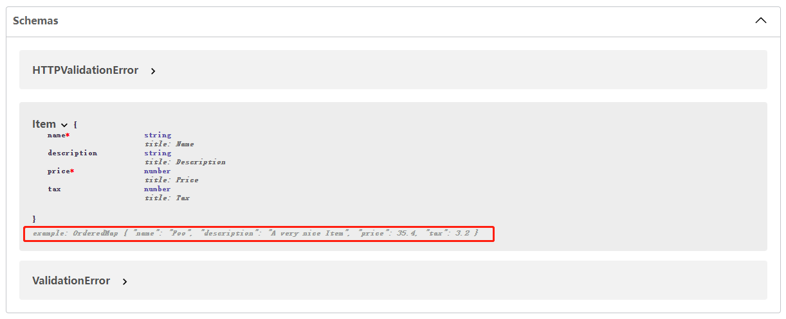
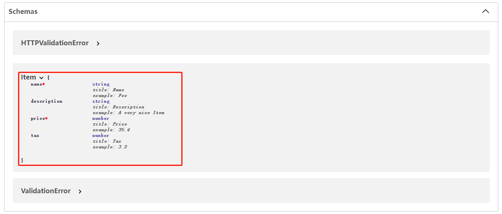
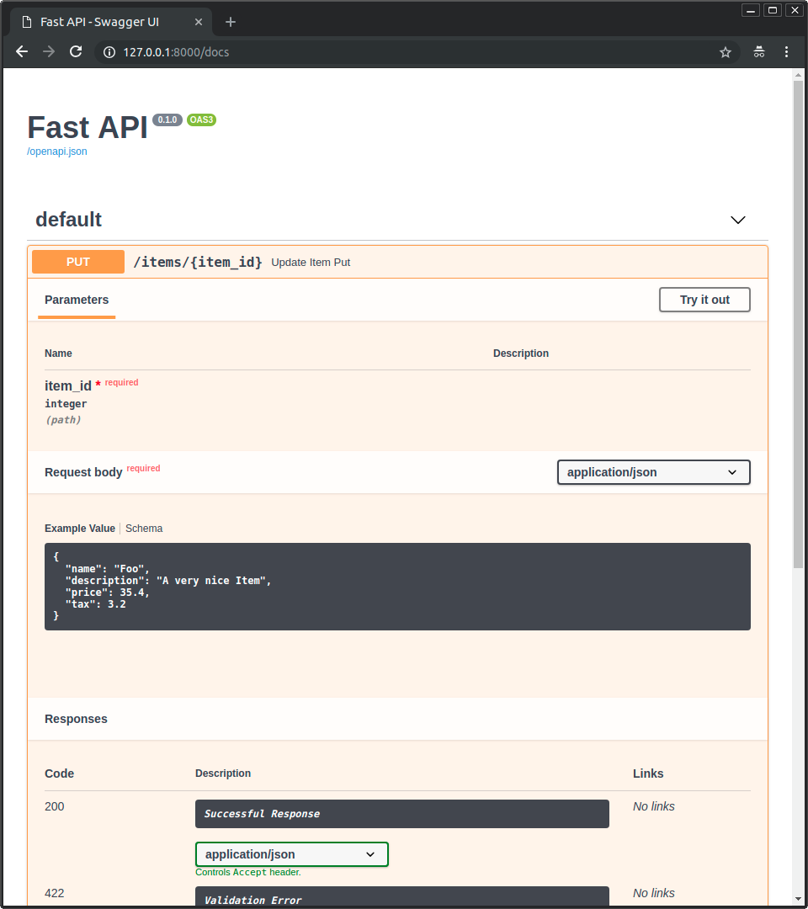
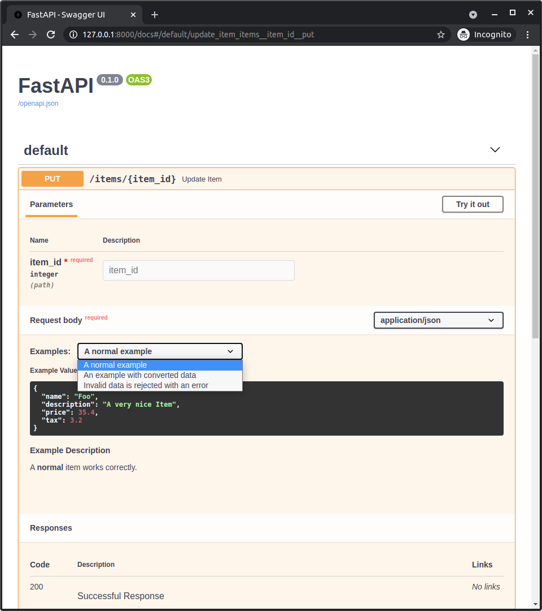

# 10_声明请求示例数据

我们可以声明在我们的app中可以接受的数据的示例。

以下是常用的几种方式：

---

## 1. Pydantic schema_extra：

我们可以使用 `Config` 和 `schema_extra` 为pydantic 模型声明一个示例 `example` ，如 [Pydantic's docs：Schema customization](https://pydantic-docs.helpmanual.io/usage/schema/#schema-customization) 所述：
```python
from fastapi import FastAPI
from pydantic import BaseModel

app = FastAPI()


class Item(BaseModel):
    name: str
    description: str | None = None
    price: float
    tax: float | None = None

    # 创建数据示例
    class Config:
        schema_extra = {
            "example": {
                "name": "Foo",
                "description": "A very nice Item",
                "price": 35.4,
                "tax": 3.2,
            }
        }


@app.put("/items/{item_id}")
async def update_item(item_id: int, item: Item):
    results = {"item_id": item_id, "item": item}
    return results
```
这些额外的信息将按原样添加到该模型的输出 JSON Schema 中，并将在 API 文档中使用。



> 我们可以使用相同的技术来扩展 JSON 模式并添加自己的自定义额外信息。
> 
> 例如，您可以使用它为前端用户界面添加元数据，等等。

---

## 2. Field 的附加参数：

当在Pydantic模型中使用 `Field()` 函数时，还可以通过向函数传递任何其他任意参数来为 JSON Schema 声明额外的信息。

如，为每个字段增加示例：
```python
from fastapi import FastAPI
from pydantic import BaseModel, Field

app = FastAPI()


class Item(BaseModel):
    name: str = Field(example="Foo")
    description: str | None = Field(default=None, example="A very nice Item")
    price: float = Field(example=35.4)
    tax: float | None = Field(default=None, example=3.2)


@app.put("/items/{item_id}")
async def update_item(item_id: int, item: Item):
    results = {"item_id": item_id, "item": item}
    return results

```

> 警告：请记住，出于生成文档的目的，这些额外传递的参数不会添加任何验证，只会添加额外的信息。

如图，文档中的每个字段会出现响应的额外信息：


---

## 3. OpenAPI中的 example 和 examples：

当使用以下任意一个工厂函数时：
- `Path()`
- `Query()`
- `Header()`
- `Cookie()`
- `Body()`
- `Form()`
- `Field()`

我们都可以声明一个数据示例 `example` 或一组 `examples` 作为附加信息添加到 OpenAPI中。

### 3.1 带示例的 Body:

这里我们传递一个在 `Body()` 中预期的数据 示例：
```python
from fastapi import Body, FastAPI
from pydantic import BaseModel

app = FastAPI()


class Item(BaseModel):
    name: str
    description: str | None = None
    price: float
    tax: float | None = None


@app.put("/items/{item_id}")
async def update_item(
    item_id: int,
    item: Item = Body(
        example={  # 添加example
            "name": "Foo",
            "description": "A very nice Item",
            "price": 35.4,
            "tax": 3.2,
        },
    ),
):
    results = {"item_id": item_id, "item": item}
    return results
```

### 文档界面中的示例：

对于上面的任何方法，它在 /docs 中都是这样的:


### 3.2 有多个 examples 的 Body：

除了单个示例之外，我们还可以使用一个包含多个示例的 `dict` 来传递示例，每个示例都包含将添加到 OpenAPI 的额外信息。

`dict` 的键标识每个示例，每个值是另一个`dict`。

示例中的每个特定示例`dict`可以包含：
- `summary`：示例的简短介绍；
- `description`：可以包含Markdown文本的长描述；
- `value`：这是所显示的实际例子，如，一个`dict`；
- `externalValue`：`value`的替代项，一个指向示例的URL。尽管这可能不会得到像 `value` 那样多的工具的支持。

```python
from fastapi import Body, FastAPI
from pydantic import BaseModel

app = FastAPI()


class Item(BaseModel):
    name: str
    description: str | None = None
    price: float
    tax: float | None = None


@app.put("/items/{item_id}")
async def update_item(
    *,
    item_id: int,
    item: Item = Body(
        examples={
            "normal": {
                "summary": "A normal example",
                "description": "A **normal** item works correctly.",
                "value": {
                    "name": "Foo",
                    "description": "A very nice Item",
                    "price": 35.4,
                    "tax": 3.2,
                },
            },
            "converted": {
                "summary": "An example with converted data",
                "description": "FastAPI can convert price `strings` to actual `numbers` automatically",
                "value": {
                    "name": "Bar",
                    "price": "35.4",
                },
            },
            "invalid": {
                "summary": "Invalid data is rejected with an error",
                "value": {
                    "name": "Baz",
                    "price": "thirty five point four",
                },
            },
        },
    ),
):
    results = {"item_id": item_id, "item": item}
    return results
```

### 文档界面中的示例：

将多个示例添加到`Body()`后，/docs 将如下所示：


---

## 4. 技术细节：

> 警告：
>  
> 这些都是关于标准 JSON Schema 和 OpenAPI 的技术细节。
>
> 如果上面的想法已经对你有用，那就足够了，你可能不需要这些细节，尽管跳过它们。

当我们使用 `schema_extra`或`Field(example="something")`在Pydantic模型中添加一个示例时，该示例将被添加到该Pydantic模型的 JSON Schema中。

同时，Pydantic模型的JSON Schema包含在我们API的OpenAPI中，然后在docs 用户界面被使用。

JSON Schema在标准中并没有真正的example字段。近期发布的JSON Schema版本定义了一个[examples字段](https://json-schema.org/draft/2019-09/json-schema-validation.html#rfc.section.9.5)，但是OpenAPI 3.0.3基于JSON Schema的旧版本，所以没有examples。

所以，OpenAPI 3.0.3为其使用的修改版本的 JSON Schema 定义了自己的example，目的相同(但它是一个单独的example，而不是examples) ，这就是 API 文档用户界面 (使用 Swagger UI)所使用的。

因此，尽管 example 不是 JSON Schema的一部分，但它是OpenAPI的JSON Schema的自定义版本中的一部分，这也是文档用户界面将要使用的内容。

但是，当我们在其他工具（如，`Query()`, `Body()`等）中使用example或examples时，这些示例不会被添加到描述数据的 JSONSchema中（甚至不会被添加到OpenAPI自己版本的JSON Schema中），他们会被直接添加到OpenAPI的路径操作声明中（在OpenAPI使用JSON Schema的部分之外）。

对于`path()`, `Query()`, `Header()`和`Cookie()`, exampel 和 examples 会添加到 [OpenAPI定义、参数对象Parameter Object（在规范中）](https://github.com/OAI/OpenAPI-Specification/blob/main/versions/3.0.3.md#parameter-object)。

对于`Body()`, `File()`和`Form()`, example 和 examples 同样会被添加到 [OpenAPI定义、请求体对象Request Body Object、内容字段content、媒体类型对象 Media Type Object （在规范中）](https://github.com/OAI/OpenAPI-Specification/blob/main/versions/3.0.3.md#mediaTypeObject)。

另一方面，最近发布了一个新版本的 OpenAPI: 3.1.0。它基于最新的 JSON Schema，并且删除了 OpenAPI 自定义版本的 JSON Schema 的大部分修改，以换得最新版本的 JSON Schema 的特性，从而减少了所有这些小的差异。尽管如此，Swagger UI 目前还不支持 OpenAPI 3.1.0，因此，现在最好继续使用上面的想法。