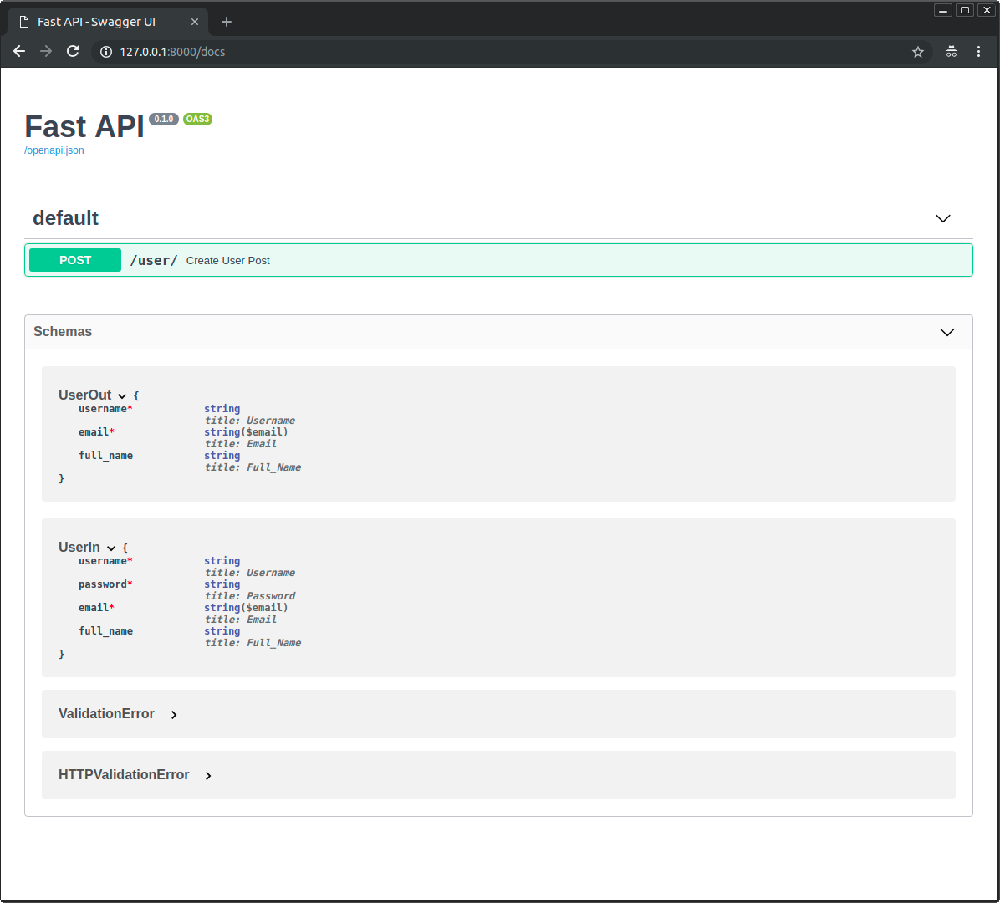
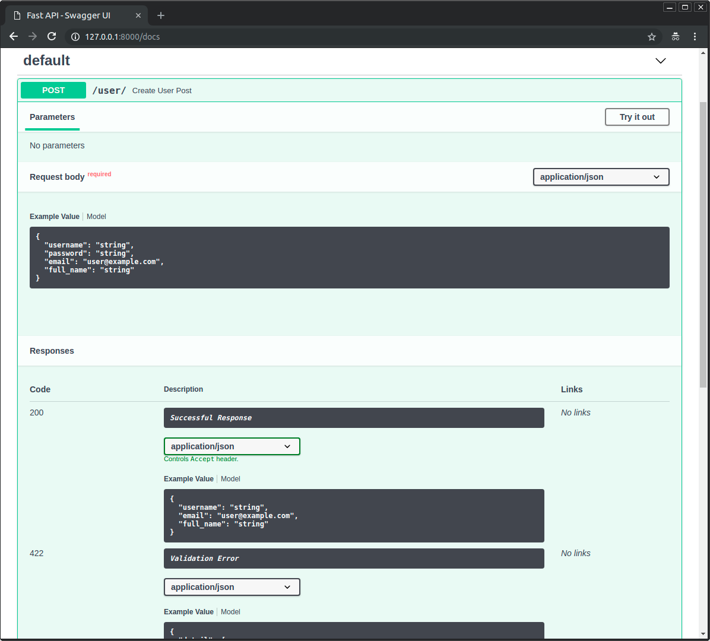

# 14_响应模型

我们可以在任意的 路径操作 中使用 `response_model` 参数来声明用于返回的响应的模型：

- `@app.get()`
- `@app.post()`
- `@app.put()`
- `@app.delete()`
- 等

```python
from fastapi import FastAPI
from pydantic import BaseModel

app = FastAPI()


class Item(BaseModel):
    name: str
    description: str | None = None
    price: float
    tax: float | None = None
    tags: list[str] = []


@app.post("/items/", response_model=Item)  # 声明响应返回Item模型
async def create_item(item: Item):
    return item
```

> 注意，`response_model`是「装饰器」方法（`get`，`post` 等）的一个`参数`。不像之前的所有参数和请求体，它不属于 路径操作函数。

它接收的类型与你将为 Pydantic 模型属性所声明的类型相同，因此它可以是一个 Pydantic 模型，但也可以是一个由 Pydantic 模型组成的 `list`，例如 `List[Item]`。

FastAPI 将使用 `response_model` 来：

- 将输出数据转换为其声明的类型。
- 校验数据。
- 在 OpenAPI 的路径操作中为响应添加一个 JSON Schema。
- 在自动生成文档系统中使用。

但最重要的是：

- 会将输出数据限制在该模型定义内。下面我们会看到这一点有多重要。

> 技术细节：
> 
> 响应模型声明在这个参数中，而不是作为函数`返回类型注解`（形如 `): -> Item`），因为路径函数可能实际上不返回响应模型，而是一个 `dict`，`数据库对象`或者`其他模型`，然后使用`response_model` 来执行字段约束和序列化。

---

## 1. 返回与输入相同的数据：

现在我们声明一个 UserIn 模型，它将包含一个明文密码属性。

我们使用该模型声明输入数据类型，同时使用它声明了模型的输出模型：

```python
from fastapi import FastAPI
from pydantic import BaseModel, EmailStr

app = FastAPI()


class UserIn(BaseModel):
    username: str
    password: str
    email: EmailStr
    full_name: str | None = None


# Don't do this in production!
@app.post("/user/", response_model=UserIn)  # 输出响应模型
async def create_user(user: UserIn):  # 输入请求体模型
    return user
```

现在，每当浏览器使用一个密码创建用户时，API 都会在响应中返回相同的密码。在这个案例中，这可能不算是问题，因为用户自己正在发送密码。

但是，如果我们在其他的路径操作中使用相同的模型，则可能会将用户的密码发送给每个客户端。

> 警告：永远不要存储用户的明文密码，也不要在响应中发送密码。

---

## 2. 添加输出模型：

相反，我们可以创建一个有明文密码的输入模型和一个没有明文密码的输出模型。

这样，即便我们的路径操作函数返回的是同一个带密码的 `user` 对象，因为我们把响应模型换为了没有明文密码的 `UserOut` 模型，FastAPI也会负责使用Pydantic将未在输出响应模型中的声明的数据过滤掉。

```python
from fastapi import FastAPI
from pydantic import BaseModel, EmailStr

app = FastAPI()


class UserIn(BaseModel):  # 带密码
    username: str
    password: str
    email: EmailStr
    full_name: str | None = None


class UserOut(BaseModel):  # 不带密码
    username: str
    email: EmailStr
    full_name: str | None = None


@app.post("/user/", response_model=UserOut)  # 输出
async def create_user(user: UserIn):  # 输入
    return user  # 返回的同一个输入对象user
```

---

## 3. 在文档中查看：

当你查看自动化文档时，你可以检查输入模型和输出模型是否都具有自己的 JSON Schema：



并且两种模型都将在交互式 API 文档中使用：



---

## 4. 响应模型编码参数：

我们的响应模型可以具有默认值，例如：
```python
class Item(BaseModel):  # 带有默认值的模型
    name: str
    description: str | None = None
    price: float
    tax: float = 10.5
    tags: list[str] = []
```

- `description: str | None = None` 具有默认值 None。
- `tax: float = 10.5` 具有默认值 10.5.
- `tags: List[str] = []` 具有一个空列表作为默认值：`[]`.

但如果返回结果对象中这几个字段并没有存储实际的值，我们可能想从结果中忽略它们的默认值。

举个例子，当你在 NoSQL 数据库中保存了具有许多可选属性的模型，但你又不想发送充满默认值的很长的 JSON 响应。如下面代码中的 `items` 字典所示。

```python
items = {
    "foo": {"name": "Foo", "price": 50.2},
    "bar": {"name": "Bar", "description": "The bartenders", "price": 62, "tax": 20.2},
    "baz": {"name": "Baz", "description": None, "price": 50.2, "tax": 10.5, "tags": []},
}
```

这时，可以使用以下方法：

### 4.1 使用 `response_model_exclude_unset` 参数:

可以设置路径操作装饰器的 `response_model_exclude_unset=True`参数：

```python
from fastapi import FastAPI
from pydantic import BaseModel

app = FastAPI()


class Item(BaseModel):
    name: str
    description: str | None = None
    price: float
    tax: float = 10.5
    tags: list[str] = []


items = {
    "foo": {"name": "Foo", "price": 50.2},
    "bar": {"name": "Bar", "description": "The bartenders", "price": 62, "tax": 20.2},
    "baz": {"name": "Baz", "description": None, "price": 50.2, "tax": 10.5, "tags": []},
}


@app.get("/items/{item_id}", response_model=Item, response_model_exclude_unset=True)  # 忽略默认值
async def read_item(item_id: str):
    return items[item_id]

```
这样响应中将不会包含那些默认值，而是仅有实际设置的值。

因此，当我们向路径操作发送ID为 `foo` 的商品请求时，返回的响应为：
```json
{
    "name": "Foo",
    "price": 50.2
}
```

> 提示：FastAPI通过 Pydantic 模型的 `.dict()` 方法配合该方法的[ `exclude_unset` 参数](https://pydantic-docs.helpmanual.io/usage/exporting_models/#modeldict)实现了此功能。

> 除此之外，还可以使用：
> 
> - `response_model_exclude_defaults=True`: 不返回值等于默认值的字段
> - `response_model_exclude_none=True`：不返回值为None的字段
> 
> 参考[Pydantic文档](https://pydantic-docs.helpmanual.io/usage/exporting_models/#modeldict)中对 `exclude_defaults` 和 `exclude_none` 的描述。

#### 默认值字段有实际值的数据：

但是，如果我们的数据对模型中带有默认值的字段有实际值，比如 ID 为 `bar` 的item:
```python
{
    "name": "Bar",
    "description": "The bartenders",  # 不同于默认值
    "price": 62,
    "tax": 20.2  # 不同于默认值
}
```
则，这些值会包含在响应中。

#### 具有与默认值相同值的数据：

如果数据具有与默认值相同的值，例如 ID 为 `baz` 的item：
```python
{
    "name": "Baz",
    "description": None,  # 和默认值相同
    "price": 50.2,
    "tax": 10.5,  # 和默认值相同
    "tags": []  # 和默认值相同
}
```
即使 `description`、`tax` 和 `tags` 具有与默认值相同的值，FastAPI 足够聪明 (实际上是 Pydantic 足够聪明) 去认识到这一点，它们的值被显式地所设定（而不是取自默认值）。

因此，它们将包含在 JSON 响应中。

> 请注意默认值可以是任何值，而不仅是`None`。
> 
> 它们可以是一个列表（`[]`），一个值为 `10.5`的 `float`，等等。

### 4.2 `response_model_include` 和`response_model_exclude`:

还可以使用路径操作装饰器的 `response_model_include` 和 `response_model_exclude` 参数。

它们接收一个由属性名称 `str` 组成的 `set` 来包含（忽略其他的）或者排除（包含其他的）这些属性。

如果你只有一个 Pydantic 模型，并且想要从输出中移除一些数据，则可以使用这种快捷方法。

> 注意：
> 
> 依然建议你使用上面提到的主意：**使用多个模型类而不是这些参数**。
> 
> 这是因为, 即使使用 `response_model_include` 或 `response_model_exclude` 来省略某些属性，在应用程序的 OpenAPI 定义（和文档）中生成的 JSON Schema 仍将是完整的模型。
>
> 这也适用于作用类似的 `response_model_by_alias`。


```python
from fastapi import FastAPI
from pydantic import BaseModel

app = FastAPI()


class Item(BaseModel):
    name: str
    description: str | None = None
    price: float
    tax: float = 10.5


items = {
    "foo": {"name": "Foo", "price": 50.2},
    "bar": {"name": "Bar", "description": "The Bar fighters", "price": 62, "tax": 20.2},
    "baz": {
        "name": "Baz",
        "description": "There goes my baz",
        "price": 50.2,
        "tax": 10.5,
    },
}


@app.get(
    "/items/{item_id}/name",
    response_model=Item,
    response_model_include={"name", "description"},  # 响应模型包含的字段集合
)
async def read_item_name(item_id: str):
    return items[item_id]


@app.get("/items/{item_id}/public", response_model=Item, response_model_exclude={"tax"})  # 响应模型排除的字段集合
async def read_item_public_data(item_id: str):
    return items[item_id]
```

#### 使用 list 代替 set：

如果你忘记使用 `set` 而是使用了 `list` 或 `tuple`，FastAPI 仍会将其转换为 `set` 并且正常工作：

```python
from fastapi import FastAPI
from pydantic import BaseModel

app = FastAPI()


class Item(BaseModel):
    name: str
    description: str | None = None
    price: float
    tax: float = 10.5


items = {
    "foo": {"name": "Foo", "price": 50.2},
    "bar": {"name": "Bar", "description": "The Bar fighters", "price": 62, "tax": 20.2},
    "baz": {
        "name": "Baz",
        "description": "There goes my baz",
        "price": 50.2,
        "tax": 10.5,
    },
}


@app.get(
    "/items/{item_id}/name",
    response_model=Item,
    response_model_include=["name", "description"],  # 使用了list
)
async def read_item_name(item_id: str):
    return items[item_id]


@app.get("/items/{item_id}/public", response_model=Item, response_model_exclude=["tax"])  # 使用了list
async def read_item_public_data(item_id: str):
    return items[item_id]
```

---

## 总结：

使用路径操作装饰器的 `response_model` 参数来定义响应模型，特别是确保私有数据被过滤掉。

使用 `response_model_exclude_unset` 来仅返回显式设定的值。