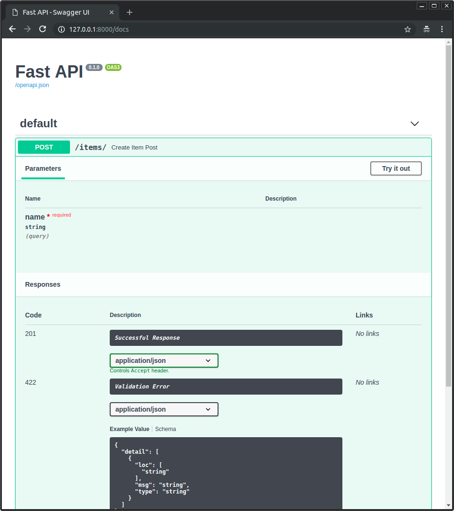
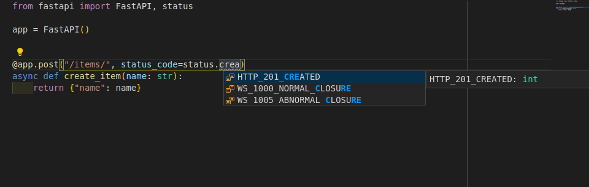

# 16_响应状态码

与指定响应模型的方式相同，我们也可以在以下任意的路径操作中使用 `status_code` 参数来声明用于响应的 HTTP 状态码：
- `@app.get()`
- `@app.post()`
- `@app.put()`
- `@app.delete()`
- 等

```python
from fastapi import FastAPI

app = FastAPI()


@app.post("/items/", status_code=201)
async def create_item(name: str):
    return {"name": name}
```


> 注意: `status_code` 是「装饰器」方法（`get`，`post` 等）的一个参数。不像之前的所有参数和请求体，它不属于路径操作函数。

`status_code` 参数接收一个表示 HTTP 状态码的数字。

> `status_code` 也能够接收一个 `IntEnum` 类型，比如 Python 的 [`http.HTTPStatus`](https://docs.python.org/3/library/http.html#http.HTTPStatus)。

它将会：
- 在响应中返回该状态码
- 在 OpenAPI 模式中（以及在用户界面中）将其记录为：
  

> 注意：
> 
> 一些响应状态码（请参阅下一部分）表示响应没有响应体。
> 
> FastAPI 知道这一点，并将生成表明没有响应体的 OpenAPI 文档。

---

## 1. 关于HTTP状态码：

> 如果你已经了解什么是HTTP状态码，可以跳过。

在 HTTP 协议中，你将发送 3 位数的数字状态码作为响应的一部分。

这些状态码有一个识别它们的关联名称，但是重要的还是数字。

简而言之：

- 100 及以上状态码用于「消息」响应。你很少直接使用它们。具有这些状态代码的响应不能带有响应体。
- 200 及以上状态码用于「成功」响应。这些是你最常使用的。
  - 200 是默认状态代码，它表示一切「正常」。
  - 另一个例子会是 201，「已创建」。它通常在数据库中创建了一条新记录后使用。
  - 一个特殊的例子是 204，「无内容」。此响应在没有内容返回给客户端时使用，因此该响应不能包含响应体。
- 300 及以上状态码用于「重定向」。具有这些状态码的响应可能有或者可能没有响应体，但 304「未修改」是个例外，该响应不得含有响应体。
- 400 及以上状态码用于「客户端错误」响应。这些可能是你第二常使用的类型。
  - 一个例子是 404，用于「未找到」响应。
对于来自客户端的一般错误，你可以只使用 400。
- 500 及以上状态码用于服务器端错误。你几乎永远不会直接使用它们。当你的应用程序代码或服务器中的某些部分出现问题时，它将自动返回这些状态代码之一。

> 要了解有关每个状态代码以及适用场景的更多信息，请查看 [MDN 关于 HTTP 状态码的文档](https://developer.mozilla.org/en-US/docs/Web/HTTP/Status)。

---

## 2. 记住名称的捷径：

让我们再次看看之前的例子：

```python
from fastapi import FastAPI

app = FastAPI()


@app.post("/items/", status_code=201)
async def create_item(name: str):
    return {"name": name}

```
`201` 是表示「已创建」的状态码。

但是你不必去记住每个代码的含义。可以使用来自 `fastapi.status` 的便捷变量。

```python
from fastapi import FastAPI, status

app = FastAPI()


@app.post("/items/", status_code=status.HTTP_201_CREATED)  # 状态码常量
async def create_item(name: str):
    return {"name": name}
```

它们只是一种便捷方式，它们具有同样的数字代码，但是这样使用你就可以使用编辑器的自动补全功能来查找它们：



> 技术细节：
> 
> 你也可以使用 `from starlette import status`。
>
> 为了给开发者提供方便，FastAPI 提供了与 `starlette.status` 完全相同的 `fastapi.status`。但它直接来自于 Starlette。

---

## 3. 更改默认状态吗：

在之后的 [高级用户指南](https://fastapi.tiangolo.com/advanced/response-change-status-code/) 中，我们将了解如何返回与在此声明的默认状态码不同的状态码。