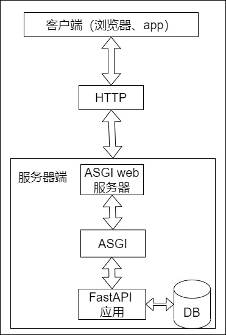
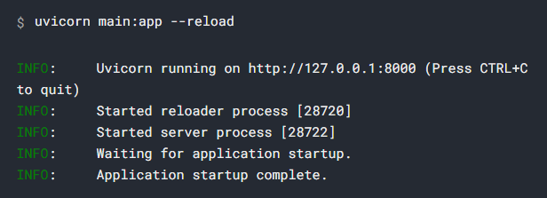
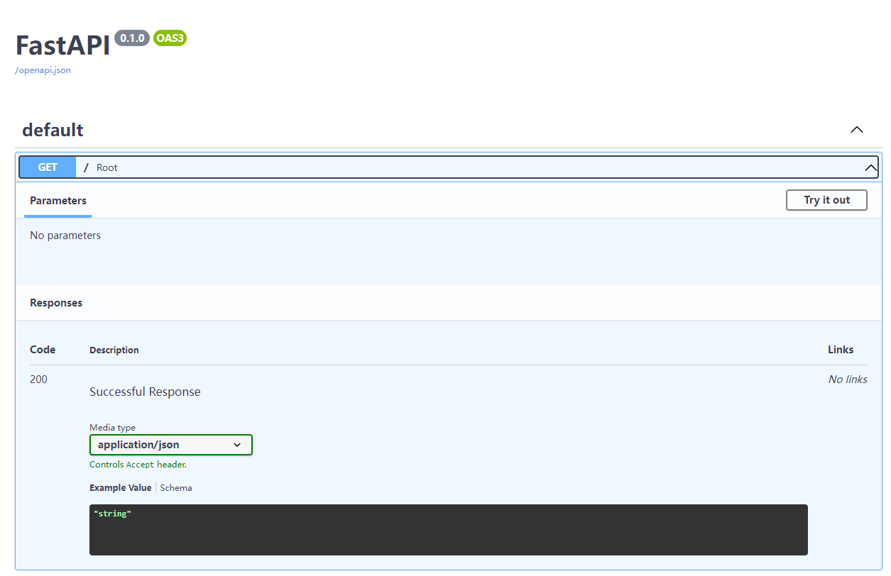
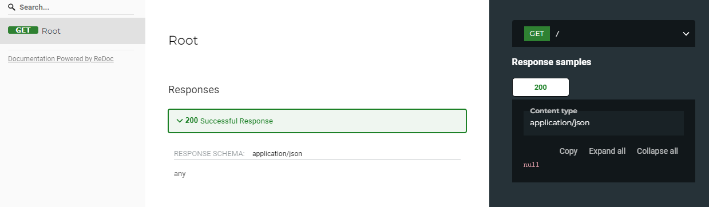

# 1_创建并运行最小应用及使用交互性文档

## 1. 最小FastAPI应用：

一个最简单的FastAPI应用可能向下面这样：

`main.py`：
```python
from fastapi import FastAPI

app = FastAPI()


@app.get("/")
async def root():
    return {"message": "Hello World"}
```

---

## 2. 启动应用：

FastAPI是一个 Python [ASGI](https://asgi.readthedocs.io/en/latest/) web应用开发框架，也就是说我们可以使用它来完成后端API接口逻辑的开发，但是他并不能直接处理 HTTP请求/WebSocket连接。我们需要使用 [Uvicorn](https://www.uvicorn.org/) ASGI web服务器 接收HTTP请求，并将其转换为符合 ASGI规范的格式 再传递给FastAPI处理。请求处理结束后，FastAPI的响应再原路返回到客户端渲染展示给用户。




FastAPI使用Uvicorn服务器来提供server服务，我们可以通过以下命令启动我们的应用：
`uvicorn main:app --reload`



其中：

- main：表示`main.py`文件（一个Python模块）。

- app：指`main.py`文件中通过`app=FastAPI()` 创建的程序对象。

- --reload：表示让服务器在源代码发生改动后自动重启。仅在开发时可以使用该选项。

其他更多参数可以使用 `uvicorn --help 命令`查看。

在命令的输出中有一行信息：
```
INFO:     Uvicorn running on http://127.0.0.1:8000 (Press CTRL+C to quit)
```
显示了应用在本机所提供服务的 URL 地址, `默认的端口port为 8000`。

---

## 3. 查看响应：

打开浏览器访问 [http://127.0.0.1:8000](http://127.0.0.1:8000) 将会看到 JSON响应：

```json
{"message": "Hello World"}
```

---

## 4. 查看交互式文档：

在浏览器中访问 [http://127.0.0.1:8000/docs](http://127.0.0.1:8000/docs) 将会看到自动生成的 Swagger UI 交互式API文档。



也可以访问 [http://127.0.0.1:8000/redoc](http://127.0.0.1:8000/redoc)查看自动生成的ReDoc API文档。



---

## 5. [OpenAPI](https://github.com/OAI/OpenAPI-Specification)：

FastAPI 使用用于定义 API 的 OpenAPI 标准生成包含所有 API 的“模式（schema）”。

### Schema 模式：

模式是对事物的一种定义或描述。它并非具体的代码实现，而只是抽象的描述。

### API Schema：

在这种情况下，OpenAPI 是一种规范，它规定了如何定义 API 的模式。

这个模式定义包括您的 API 路径、它们可能采用的参数等等。

### Data Schema:

术语“模式”也可能指某些数据的形状，比如 JSON 内容。

在这种情况下，它意味着 JSON 属性，以及它们所拥有的数据类型等等。

### OpenAPI 与 JSON Schema：

OpenAPI 为您的 API 定义了一个 API 模式。该模式包括了我们的 API 使用 JSON 模式(JSON 数据模式的标准)发送和接收的数据的定义(或“模式”)。

### 查看 openapi.json：

如果你对原始的 OpenAPI 模式长什么样子感到好奇，其实它只是一个自动生成的包含了所有 API 描述的 JSON。

可以直接访问 [http://127.0.0.1:8000/openapi.json](http://127.0.0.1:8000/openapi.json)查看它：

```json
{
  "openapi": "3.0.2",
  "info": {
    "title": "FastAPI",
    "version": "0.1.0"
  },
  "paths": {
    "/": {
      "get": {
        "summary": "Root",
        "operationId": "root__get",
        "responses": {
          "200": {
            "description": "Successful Response",
            "content": {
              "application/json": {
                "schema": {}
              }
            }
          }
        }
      }
    }
  }
}
```

## OpenAPI的用途：

OpenAPI schema 是FastAPI中内置的两个交互式文档系统的驱动。

并且还有数十种替代方案，它们全部都基于 OpenAPI。你可以轻松地将这些替代方案中的任何一种添加到使用 FastAPI 构建的应用程序中。

你还可以使用它自动生成与你的 API 进行通信的客户端代码。例如 web 前端，移动端或物联网嵌入程序。

---

## 5. FastAPI应用创建步骤概括：

1. 导入FastAPI类：
   
   `from fastapi import FastAPI`

   FastAPI 是一个为你的 API 提供了所有功能的 Python 类。它继承自Starlette中的类。我们可以通过它使用所有Starlette的功能。

2. 创建一个FastAPI实例：
   
   `app = FastAPI()`

   这里的变量 `app` 是 `FastAPI` 类的一个实例，是我们创建所有 API 的主要交互对象。

   这个`app`同样会在 `uvicorn` 命令中被引用：`uvicorn main:app --reload`。

    如果你像下面这样创建应用：
    `my_awesome_api = FastAPI()`。

    那么启动应用的命令就要改为：`uvicorn main:my_awesome_api --reload`。

3. 创建一个路径和操作：
   
   - path:
   
     这里的路径 path 指的是 URL中从第一个 `/` 开始及之后 的部分。
 
     如 URL：`https://example.com/items/foo` 中的  path 指 `/items/foo`。
 
     「路径 path」也被称为 「端点 endpoint」或「路由  route」。

     开发 API 时，「路径」是用来分离「关注点 concerns」和「资源 resources」的主要手段。
  
   - operation：
     
     这里的操作 operation 指 HTTP 方法 methods。

     可以是 `POST`、`GET`、`DELETE`、`PUT`，或者不常见的`OPTIONS`、`HEAD`、`PATCH`、`TRACE`。

     在HTTP协议中，我们可以使用上面一种或多种方法与每个路径进行通信。

     在开发 API 时，通常使用特定的 HTTP 方法去执行特定的行为。

     通常使用：
     
     - POST：创建数据。
     - GET：读取数据。
     - PUT：更新数据。
     - DELETE：删除数据。

     因此，在 OpenAPI 中，每一个 HTTP 方法都被称为「操作 operation」。
     
     我们也打算称呼它们为「操作 operation」。

    ---
   
    定义一个路径操作装饰器：
     
     ```python
     @app.get("/")
     async def root():
         return {"message": "Hello World"}
     ```
     
     我们使用 `@app.get('/')`装饰器来告诉FastAPI，在它下面的函数负责处理如下访问请求：
     - 请求路径为 `/`
     - 使用 `get` 操作
    
    也可以使用其他的操作：
    - @app.post()
    - @app.put()
    - @app.delete()
    - @app.options()
    - @app.head()
    - @app.patch()
    - @app.trace()

    > 你可以随意使用任何一个操作（HTTP 方法）。FastAPI没有强制要求操作有任何特定的含义。
    > 
    > 此处提供的信息仅作为指导，而不是要求。
    > 
    > 比如，当使用 GraphQL 时通常你所有的动作都通过 post 一种方法执行。

4. 定义路径操作函数（path operation function）：
   
   这里我们路径操作函数：
   - path: /
   - operation: get
   - function: 位于装饰器下方的函数。
   ```python
   @app.get("/")
   async def root():
       return {"message": "Hello World"}
   ```
   这是一个Python函数，每当FastAPI接收到一个使用 `GET` 方法访问 URL `/` 的请求时这个函数就会被调用。

   在这个例子中，他是一个 `async` 函数。

   你也可以将其定义为常规函数而不使用 `async def`：
   ```python
   from fastapi import FastAPI
   
   app = FastAPI()
   
   
   @app.get("/")
   def root():
       return {"message": "Hello World"}
   ```

   关于二者的区别，参考 [Async：in a hurry?](https://fastapi.tiangolo.com/async/#in-a-hurry)

5. 返回内容：

   在函数中的 `return {"message": "Hello World"}`, 就是返回的响应内容。

   我们可以返回 `dict`、`list` 或像 `str`、`int` 一样的单个值等等。

   你还可以返回 Pydantic 模型（稍后你将了解更多）。

   还有许多其他将会自动转换为 JSON 的对象和模型（包括 ORM 对象等）。尝试下使用你最喜欢的一种，它很有可能已经被支持。

---

## 总结：

创建并运行FastAPI应用的步骤为：

- 导入 FastAPI。
- 创建一个 app 实例。
- 编写一个路径操作装饰器（如 @app.get("/")）。
- 编写一个路径操作函数（如上面的 def root(): ...）。
- 运行开发服务器（如 uvicorn main:app --reload）。