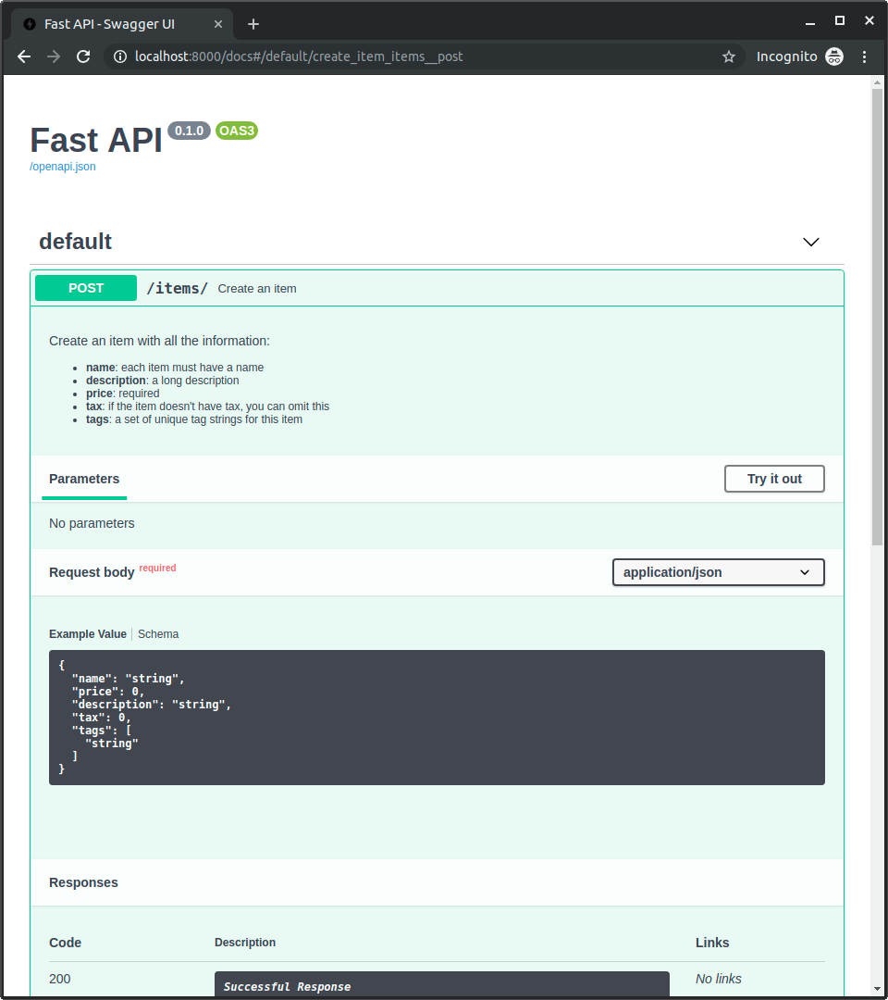

# 21_路径操作配置

路径操作装饰器支持使用多种参数进行配置。

> 警告：以下参数应直接传递给路径操作装饰器，而不是路径操作函数。

---

## 1. 响应状态码：

我们可以使用 `status_code` 参数定义路径操作响应的状态码。

直接给他传递一个 `int`值，如`404`。

但是，如果不记得每个数字代表的含义了，可以使用`status`快捷常量：

```python
from fastapi import FastAPI, status
from pydantic import BaseModel

app = FastAPI()


class Item(BaseModel):
    name: str
    description: str | None = None
    price: float
    tax: float | None = None
    tags: set[str] = set()


@app.post("/items/", response_model=Item, status_code=status.HTTP_201_CREATED)  # 设置响应状态码为201
async def create_item(item: Item):
    return item
```
这样状态码就会被添加到响应中，同时也添加到 OpenAPI schema中。

> 技术细节：
>
> 也可以使用 `from starlette import status` 导入状态码。
>
> FastAPI 的`fastapi.status` 和 `starlette.status` 一样，只是快捷方式。实际上，`fastapi.status` 直接继承自 Starlette。

---

## 2. 标签 tags：

可以为路径操作添加标签，给`tags`参数传递一个`str`列表（通常只有一个`str`):

```python
from fastapi import FastAPI
from pydantic import BaseModel

app = FastAPI()


class Item(BaseModel):
    name: str
    description: str | None = None
    price: float
    tax: float | None = None
    tags: set[str] = set()


@app.post("/items/", response_model=Item, tags=["items"])  # 添加items tag
async def create_item(item: Item):
    return item


@app.get("/items/", tags=["items"])  # 添加items tag
async def read_items():
    return [{"name": "Foo", "price": 42}]


@app.get("/users/", tags=["users"])  # 添加users tag
async def read_users():
    return [{"username": "johndoe"}]
```

这些标签将被添加到 OpenAPI Schema中，并由自动文档接口使用:


### 带枚举的标签：

如果我们有一个大型应用，那么最终可能会累积很多个标签，并且我们希望确保对于相关的路径操作始终使用相同的标签。

在这种情况下，将标签储存在 枚举`Enmu` 中就显得很有必要了。

FastAPI支持枚举，就像普通的字符串一样：

```python
from enum import Enum

from fastapi import FastAPI

app = FastAPI()


class Tags(Enum):  # 定义枚举类
    items = "items"
    users = "users"


@app.get("/items/", tags=[Tags.items])  # 使用枚举标签
async def get_items():
    return ["Portal gun", "Plumbus"]


@app.get("/users/", tags=[Tags.users])  # 使用枚举标签
async def read_users():
    return ["Rick", "Morty"]
```

---

## 3. `summary` 与 `description` 参数：

路径装饰器还支持 `summary` 和 `description` 这两个参数, 用来描述路径操作。

```python
from fastapi import FastAPI
from pydantic import BaseModel

app = FastAPI()


class Item(BaseModel):
    name: str
    description: str | None = None
    price: float
    tax: float | None = None
    tags: set[str] = set()


@app.post(
    "/items/",
    response_model=Item,
    summary="Create an item",
    description="Create an item with all the information, name, description, price, tax and a set of unique tags",
)
async def create_item(item: Item):
    return item
```

---

## 4. 从文档字符串（docstring）进行描述：

由于描述往往很长并且覆盖多行，可以在函数 `docstring(一个多行的字符串，是函数中的第一个表达式（并未分配给任何变量），用来作为文档信息)` 中声明路径操作描述，FastAPI将从那里读取它。

我们可以在 docstring 中使用Markdown格式，他将被正确的解释和显示（考虑docstring缩进）。

```python
from fastapi import FastAPI
from pydantic import BaseModel

app = FastAPI()


class Item(BaseModel):
    name: str
    description: str | None = None
    price: float
    tax: float | None = None
    tags: set[str] = set()


@app.post("/items/", response_model=Item, summary="Create an item")
async def create_item(item: Item):
    """
    Create an item with all the information:

    - **name**: each item must have a name
    - **description**: a long description
    - **price**: required
    - **tax**: if the item doesn't have tax, you can omit this
    - **tags**: a set of unique tag strings for this item
    """
    # 以上文档字符串docstring将作为路径操作的description参数内容
    return item
```

他将会被用在交互式文档中：



---

## 5. 响应描述：

可以通过`response_description`参数指定响应描述信息：

```python
from fastapi import FastAPI
from pydantic import BaseModel

app = FastAPI()


class Item(BaseModel):
    name: str
    description: str | None = None
    price: float
    tax: float | None = None
    tags: set[str] = set()


@app.post(
    "/items/",
    response_model=Item,
    summary="Create an item",
    response_description="The created item",  # 响应描述
)
async def create_item(item: Item):
    """
    Create an item with all the information:

    - **name**: each item must have a name
    - **description**: a long description
    - **price**: required
    - **tax**: if the item doesn't have tax, you can omit this
    - **tags**: a set of unique tag strings for this item
    """
    return item
```

> 说明：
>
> 注意：`response_description`只用于描述响应，`description`一般则用于描述路径操作。

> 检查：
>
> OpenAPI 规定每个路径操作都要有响应描述。
>
> 如果没有定义响应描述，FastAPI 则自动生成内容为 "Successful response" 的响应描述。


---

## 6. 弃用路径操作：

如果想要将一个路径操作标记为 弃用deprecated (过时，不推荐再使用) ，但不想删除它，则可以使用`deprecated`参数进行标记：

```python
from fastapi import FastAPI

app = FastAPI()


@app.get("/items/", tags=["items"])
async def read_items():
    return [{"name": "Foo", "price": 42}]


@app.get("/users/", tags=["users"])
async def read_users():
    return [{"username": "johndoe"}]


@app.get("/elements/", tags=["items"], deprecated=True)  # 标记为弃用
async def read_elements():
    return [{"item_id": "Foo"}]
```

对应路径操作会在交互式文档中明确标记为弃用：


下图显示了正常路径操作与弃用路径操作 的区别：


---

## 总结：

通过将参数传递给路径操作装饰器，可以轻松地对路径操作进行配置和添加元数据。