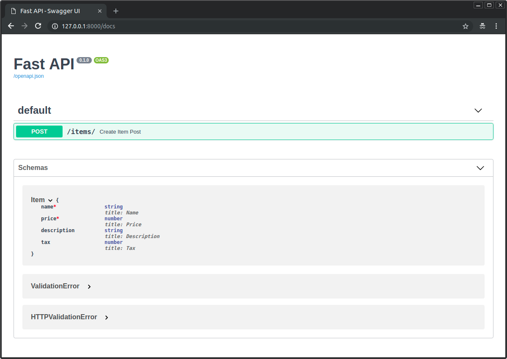
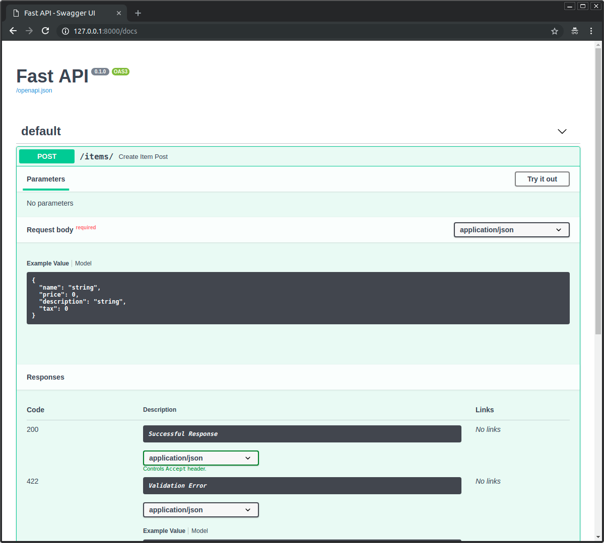

# 4_请求体

在HTTP请求中，如果需要将数据从客户端（如，浏览器）发送给API，则我们会将其作为“请求体（request body）”发送。

**请求体**是客户端发送给API的数据；**响应体**是API发送给客户端的数据。

我们的API几乎总是要返回给用户响应体的，但是客户端并不总是需要发送请求体。

在FastAPI中我们使用Pydantic Model来声明请求体，同时能够获得Model所有的能力和优点。

> 在HTTP请求中，我们不能使用 `GET` 操作发送请求体；
> 
> 我们需要使用以下方法之一发送数据：`POST`(较常见)、`PUT`、`DELETE` 或`PATCH`。

---

## 1. 导入Pydantic的BaseModel：

首先，我们需要从Pydantic导入 `BaseModel`：

```python
from typing import Union
from fastapi import FastAPI

from pydantic import BaseModel  # 导入
...
```

---

## 2. 创建数据模型：

然后，将我们需要的数据模型声明为继承自 `BaseModel` 的类。

并使用标准的Python类型提示来给所有属性字段作注解：
```python
class Item(BaseModel):
    name: str  # 必需属性
    description: Union[str, None] = None  # 可选属性
    price: float  # 必需属性
    tax: Union[float, None] = None  # 可选属性
```
和声明查询参数时一样，当一个模型属性：
- 具有默认值时，它是`非必需`的
- 没有设置默认值，则它是一个`必需属性`
- 将默认值设为 None 可使其成为`可选属性`。

如，上面的模型声明了一个这样的 JSON「object」（或 Python dict）：
```json
{
    "name": "Foo",
    "description": "An optional description",
    "price": 45.2,
    "tax": 3.5
}
```
由于 `description` 和 `tax` 是可选的（它们的默认值为 None），下面的 JSON「object」也将是有效的：
```json
{
    "name": "Foo",
    "price": 45.2
}
```

---

## 3. 声明为参数：

使用和路径参数/查询参数相同的方式对请求体进行声明，并将参数类型声明为上面定义的`Item`模型，即可将其添加到「路径操作」中：
```python
...
app = FastAPI()

@app.post("/items/")
async def create_item(item: Item):  # 声明请求体为参数
    return item
```

---

以上示例完整代码为：

python3.10+：
```python
from fastapi import FastAPI
from pydantic import BaseModel


class Item(BaseModel):  # 属性类型声明使用python3.10中的新方式
    name: str
    description: str | None = None
    price: float
    tax: float | None = None


app = FastAPI()


@app.post("/items/")
async def create_item(item: Item):
    return item
```
python3.6+
```python
from typing import Union
from fastapi import FastAPI
from pydantic import BaseModel


class Item(BaseModel):
    name: str
    description: Union[str, None] = None
    price: float
    tax: Union[float, None] = None


app = FastAPI()


@app.post("/items/")
async def create_item(item: Item):
    return item

```
---

## 4. 结果：

只需要使用Python的类型声明，FastAPI将会：
1. 从请求中读取请求体作为JSOn对象；
2. 转换成相应的类型（如果需要）；
3. 验证数据：
   
   如果数据不合法，它将一个清晰易读的错误，指出数据中不正确部分的确切位置和内容。

4. 将接收到的数据赋值给 `item` 参数中：
   
   于你已经在函数中将它声明为 `Item` 类型，你还将获得对于所有属性及其类型的一切编辑器支持（代码补全等）。

5. 为我们的模型生成 [JSON Schema](https://json-schema.org/) 定义，我们可以在其他任何对项目有意义的地方使用它们。
6. 这些模式将成为生成的OpenAPI模式的一部分，并且被自动化文档 UI 所使用。

---

## 5. 自动化文档：

我们所定义模型的JSON Schema将会成为自动生成的 OpenAPI Schema的一部分，并且在交互式API文档中展示：


而且还将在每个需要他们的路径操作的API文档中使用：


---

## 6. 编辑器支持：

在编辑器中，我们可以在函数内部的任意地方得到类型提示和代码补全（如果我们接收的是一个`dict`，而不是Pydantic模型，就不能享受这些功能）：


同时我们也能获得对不正确类型操作的错误检查：


这并非偶然，FastAPI整个框架都是围绕该设计而构建的。

并且在进行任何实现之前，已经在设计阶段经过了全面的测试，以确保其可以在所有的编辑器中生效（如，VSCode、PyCharm和绝大多数Python编辑器）。

甚至Pydantic本身也进行了一些更改以支持此功能。

---

## 7. 使用模型：

在函数内部，我们可以直接访问模型对象的所有属性：
```python
from typing import Union
from fastapi import FastAPI
from pydantic import BaseModel


class Item(BaseModel):
    name: str
    description: Union[str, None] = None
    price: float
    tax: Union[float, None] = None


app = FastAPI()


@app.post("/items/")
async def create_item(item: Item):
    item_dict = item.dict()
    # 访问模型对象属性
    if item.tax:
        price_with_tax = item.price + item.tax
        item_dict.update({"price_with_tax": price_with_tax})
    return item_dict
```

---

## 8. 请求体 + 路径参数：

我们可以同时声明路径参数和请求体。FastAPI将识别出与路径参数匹配的函数参数**应从路径中获取**，而声明为 Pydantic model 的函数参数**应从请求体中获取**。

```python
from typing import Union
from fastapi import FastAPI
from pydantic import BaseModel


class Item(BaseModel):
    name: str
    description: Union[str, None] = None
    price: float
    tax: Union[float, None] = None


app = FastAPI()


@app.put("/items/{item_id}")
async def create_item(item_id: int, item: Item):
    return {"item_id": item_id, **item.dict()}
```
`item_id`从URL路径中获取，`item`从请求体中获取。

---

## 9. 请求体 + 路径参数 + 查询参数：

我们还可以同时声明请求体、路径参数和查询参数。FastAPI会从正确的位置识别并获取数据。

```python
from typing import Union
from fastapi import FastAPI
from pydantic import BaseModel


class Item(BaseModel):
    name: str
    description: Union[str, None] = None
    price: float
    tax: Union[float, None] = None


app = FastAPI()


@app.put("/items/{item_id}")
async def create_item(item_id: int, item: Item, q: Union[str, None] = None):
    result = {"item_id": item_id, **item.dict()}
    if q:
        result.update({"q": q})
    return result
```

函数参数将依次按如下规则进行识别：

- 如果在URL路径中声明了该参数，它将被用作路径参数。
- 如果参数属于单一类型（singular type, 比如 int、float、str、bool 等）它将被解释为查询参数。
- 如果参数的类型被声明为一个 Pydantic 模型，它将被解释为请求体。

> FastAPI 将知道 `q` 的值不是必需的，因为默认值为 `None`。
> 
> FastAPI 不会使用 `Union[str，None]` 中的`Union`，但它允许您的编辑器提供更好的支持并检测错误。

---

## 10. 不使用 Pydantic：

如果你不想使用 Pydantic model，也可以直接使用请求中的 `Body` 参数，参考：[Body - Multiple Parameters: Singular values in body](https://fastapi.tiangolo.com/tutorial/body-multiple-params/#singular-values-in-body)
