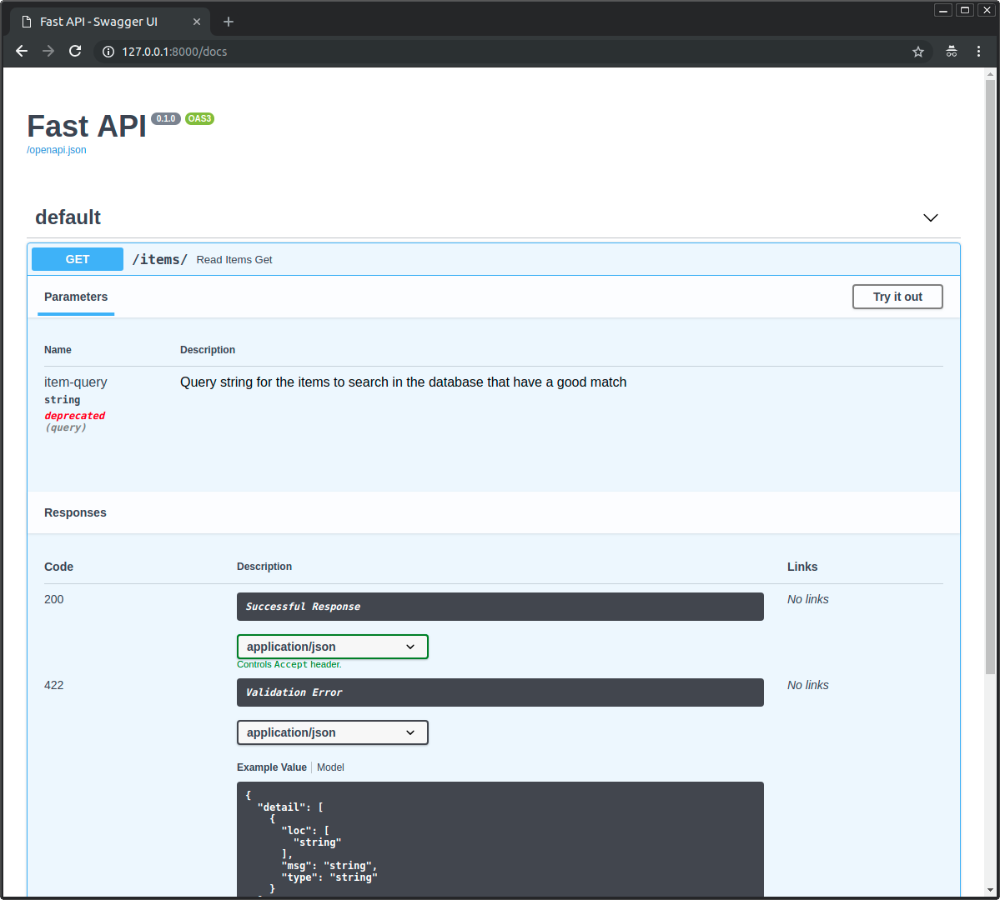

# 5_查询参数和字符串校验

FastAPI允许我们为参数声明额外的信息和校验。

以下面的程序为例：
```python
from fastapi import FastAPI

app = FastAPI()


@app.get("/items/")
async def read_items(q: str | None = None):
    results = {"items": [{"item_id": "Foo"}, {"item_id": "Bar"}]}
    if q:
        results.update({"q": q})
    return results
```

代码中查询参数 `q` 类型为 `str`，默认值为 `None`，因此它是可选参数。

接下来我们为它添加额外的校验功能。

---

## 1. 添加额外校验：

我们打算添加约束条件：即使 `q` 是可选的，但是只要提供了该参数，则该参数值长度不能超过 50 个字符。

为此，我们需要使用 FastAPI  提供的 `Query` 类。

```python
from fastapi import FastAPI, Query
...
```

---

## 2. 使用Query作为默认值：

现在，将 Query 用作查询参数的默认值，并将它的 `max_length` 参数设置为 50：

```python
from fastapi import FastAPI, Query

app = FastAPI()


@app.get("/items/")
async def read_items(q: str | None = Query(default=None, max_length=50)):
    results = {"items": [{"item_id": "Foo"}, {"item_id": "Bar"}]}
    if q:
        results.update({"q": q})
    return results

```

现在必须使用 `Query(default=None)` 替换默认值`None`， Query的第一个参数同样也是用于定义默认值的。

所以，

`q: Union[str, None]` = `Query(default=None)` 或者 `q: str | None` = `Query(default=None)`

这使得参数成为可选的，等同于：

`q: Union[str, None] = None` 或者 `q: str | None = None`

但是 `Query` 显式地将其声明为查询参数Query类型。

> 记住，让参数成为可选参数最重要的部分是: ` = None` 或者 `= Query(default=None)`。
> 
> 因为它将使用None作为默认值，这样就不需要该参数。
> `Union[str，None]` 或 `str | None`部分允许编辑器提供更好的支持，但这并不是告诉FastAPI不需要这个参数的原因。

然后，我们可以将更多的参数传递给 `Query`。在本例中，使用了校验字符串长度的 `max_length` 参数：

```python
q: Union[str, None] = Query(default=None, max_length=50)
```

这将会对 `q` 的数据进行额外校验，在数据无效时展示清晰的错误信息，并在OpenAPI Schema 的路径操作中记录该参数。

---

## 3. 添加更多校验：

我们还可以添加 `min_length` 参数：

```python
@app.get("/items/")
async def read_items(q: str | None = Query(default=None, min_length=3, max_length=50)):
...
```

---

## 4. 添加正则表达式校验：

我们可以使用 `regex` 参数定义一个查询参数值必须匹配的正则表达式：
```python
from fastapi import FastAPI, Query

app = FastAPI()


@app.get("/items/")
async def read_items(
    q: str
    | None = Query(default=None, min_length=3, max_length=50, regex="^fixedquery$")
):
    results = {"items": [{"item_id": "Foo"}, {"item_id": "Bar"}]}
    if q:
        results.update({"q": q})
    return results

```

这个指定的正则表达式通过以下规则检查接收到的参数值：

- `^`：以该符号之后的字符开头，符号之前没有字符。
- `fixedquery`: 值精确地等于 fixedquery。
- `$`: 到此结束，在 fixedquery 之后没有更多字符。

如果你对所有的这些「正则表达式」概念感到迷茫，请不要担心。对于许多人来说这都是一个困难的主题。你仍然可以在无需正则表达式的情况下做很多事情。

但是，一旦你需要用到并去学习它们时，请了解你已经可以在 FastAPI 中直接使用它们。

---

## 5. 默认值：

你可以向 `Query` 的第一个参数传入 `None` 用作查询参数的默认值，以同样的方式你也可以传递其他默认值。

假设你想要声明查询参数 `q`，使其 `min_length` 为 3，并且默认值为 `fixedquery`：
```python
from fastapi import FastAPI, Query

app = FastAPI()


@app.get("/items/")
async def read_items(q: str = Query(default="fixedquery", min_length=3)):
    results = {"items": [{"item_id": "Foo"}, {"item_id": "Bar"}]}
    if q:
        results.update({"q": q})
    return results
```

> 具有默认值还会使该参数成为可选参数!!!

---

## 6. 声明为必需参数：

当我们不需要声明额外的校验或元数据时，只需不声明默认值就可以使 `q` 参数成为必需参数，例如：使用`q: str`替换`q: str = None`。

但是现在我们使用 `Query` 来声明它, 例如：`q: Union[str, None] = Query(default=None, min_length=3)`。

### 6.1 不设置默认值default，使其成为必需参数：

当使用 `Query` 且需要声明一个查询参数是必需的时，我们可以同样的不为其设置默认值`default`：
```python
@app.get("/items/")
async def read_items(q: str = Query(min_length=3)):
    ...
```

### 6.2 使用省略号(ellipsis) ... 设置为必需参数:

还有另一种方法可以显式声明需要某个值。可以将`default`参数设置为文本值`...` :
```python
@app.get("/items/")
async def read_items(q: str = Query(default=..., min_length=3)):
    ...
```
这将使 FastAPI 知道此查询参数是必需的。

> 如果你以前没有看到过`...`: 它是一个特殊的单值(single value)，它是 [Python 的一部分，称为“ Ellipsis”](https://docs.python.org/3/library/constants.html#Ellipsis)。
>
> Pydantic 和 FastAPI 使用它来显式地声明一个值是必需的。

### 6.3 设置 None 是必需参数：

我们也可以声明一个参数能接收 `None`，但它仍然是一个必需参数。这会迫使客户端必需发送一个参数值，即使这个值是`None`。

要实现这个目的，我们可以声明 `None` 是有效类型(`q: str | None`)，但依然设置 `default=...` 表示该参数必需:

```python
@app.get("/items/")
async def read_items(q: str | None = Query(default=..., min_length=3)):
    ...
```
> Pydantic是FastAPI中所有数据验证和序列化的驱动，当你在没有默认值的情况下使用`Optional`或`Union[Something，None]`时，它有一个特殊的行为，您可以在Pydantic文档中阅读关于[Required Optional fields](https://pydantic-docs.helpmanual.io/usage/models/#required-optional-fields)的更多信息。

### 6.4 使用Pydantic 的 `Required` 替换省略号，设置为必需参数：

如果你感觉使用省略号 `...` 不习惯，也可以使用Pydantic 提供的 `Required` 设置`default`参数:
```python
from fastapi import FastAPI, Query
from pydantic import Required

app = FastAPI()


@app.get("/items/")
async def read_items(q: str = Query(default=Required, min_length=3)):
    results = {"items": [{"item_id": "Foo"}, {"item_id": "Bar"}]}
    if q:
        results.update({"q": q})
    return results

```

> 总结：FastAPI提供了以上4中方法来将一个`Query`查询参数设置为必需参数。
> 
> 但请记住，在大多数情况下，当必需某个参数时，我们可以简单地忽略`default`参数即可，因此通常不必使用`...`或`Required`。

---

## 7. 查询参数列表/多个值：

当使用 `Query` 显式地定义查询参数时，你还可以声明它去接收一组值，或换句话来说，接收多个值。

例如，要声明一个可在 URL 中出现多次的查询参数 `q`，你可以这样写：
```python
@app.get("/items/")
async def read_items(q: list[str] | None = Query(default=None)):
    query_items = {"q": q}
    return query_items
```
之后，当像`http://localhost:8000/items/?q=foo&q=bar`这样有多个`q`值的URL被访问时，在路径操作函数中 `q` 就会得到一个包含 `foo` 和 `bar` 的Python 列表。

因此，该URL的响应将会是：
```json
{
  "q": [
    "foo",
    "bar"
  ]
}
```
> 注意：要声明类型为 `list` 的查询参数，如上例所示，你需要显式地使用 `Query`，否则该参数将被解释为请求体。

交互式 API 文档将会相应地进行更新，以允许使用多个值：


### 7.1 具有默认值的查询参数列表 / 多个值：

你也可以在没有任何给定值时定义一个默认的 list 值：
```python
@app.get("/items/")
async def read_items(q: list[str] = Query(default=["foo", "bar"])):
    ...
```

这时，如果访问`http://localhost:8000/items/`, `q` 的默认值将会是 `["foo", "bar"]`，同时响应为：
```json
{
  "q": [
    "foo",
    "bar"
  ]
}
```

#### 直接使用 list：

我们还可以直接使用 `list` 代替 `List[str]` 或 l`ist[str]`：
```python
@app.get("/items/")
async def read_items(q: list = Query(default=[])):  # 不指定元素类型
    ...
```
不过，这样 FastAPI将不能检查列表的内容类型。例如，`List[int]` 将检查（并记录到文档）列表的内容必须是整数。但是单独的 list 不会。

---

## 8. 声明更多元数据：

你可以添加更多关于该参数的信息。这些信息将包含在生成的 OpenAPI Schema 中，并由文档用户界面和我不工具所使用。

> 注意：不同工具对OpeAPI的支持程度可能不同。其中一些可泵不会展示所有已声明的额外信息，尽管在大多数情况下，缺少的这部分功能已经计划进行开发。

### 8.1 添加 title：

```python
@app.get("/items/")
async def read_items(
    q: str | None = Query(default=None, title="Query string", min_length=3)
):
    ...
```

### 8.2 添加 description：
```python
@app.get("/items/")
async def read_items(
    q: str
    | None = Query(
        default=None,
        title="Query string",
        description="Query string for the items to search in the database that have a good match",
        min_length=3,
    )
):
    ...
```

---

## 9. 别名参数：

假设我们像查询的参数为 `item-query`，像这样：`http://127.0.0.1:8000/items/?item-query=foobaritems`。

但是`item-query`不是一个有效的Python变量名。

最接近的有效名称是`item_query`。

但是，我们依然要求它在 URL 中必须是 `item-query`。

此时可以使用`alias`参数声明一个别名，该别名将用于在URL中查找查询参数值：
```python
@app.get("/items/")
async def read_items(q: str | None = Query(default=None, alias="item-query")):
    results = {"items": [{"item_id": "Foo"}, {"item_id": "Bar"}]}
    if q:
        results.update({"q": q})
    return results
```
在这个示例中 URL中 `item-query`的值，将会被传递给 `q` 参数。

---

## 10. 弃用参数：

现在假设你不再喜欢此参数。

你不得不将其保留一段时间，因为有些客户端正在使用它，但你希望文档清楚地将其展示为已弃用（deprecated）。

那么将参数 `deprecated=True` 传入 `Query`：
```python
from fastapi import FastAPI, Query

app = FastAPI()


@app.get("/items/")
async def read_items(
    q: str
    | None = Query(
        default=None,
        alias="item-query",
        title="Query string",
        description="Query string for the items to search in the database that have a good match",
        min_length=3,
        max_length=50,
        regex="^fixedquery$",
        deprecated=True,  # 已弃用
    )
):
    results = {"items": [{"item_id": "Foo"}, {"item_id": "Bar"}]}
    if q:
        results.update({"q": q})
    return results
```

API文档会像下面这样展示它：


---

## 11. 从OpenAPI中排除：

要从生成的 OpenAPI Schema中排除查询参数(从而从自动文档系统中排除查询参数) ，请将`Query`的 `include_in_schema` 参数设置为 `False`:
```python
@app.get("/items/")
async def read_items(
    hidden_query: str | None = Query(default=None, include_in_schema=False)
):
    if hidden_query:
        return {"hidden_query": hidden_query}
    else:
        return {"hidden_query": "Not found"}
```

---

## 总结：

我们可以为查询参数声明额外的校验和元数据：

通用的校验和元数据：
- alias
- title
- description
- deprecated

特定于字符串的校验：
- min_length
- max_length
- regex

在这些示例中我们看到了如何为 `str` 值声明校验。

在下一章中将看到如何为其他类型声明校验，如，数字等。