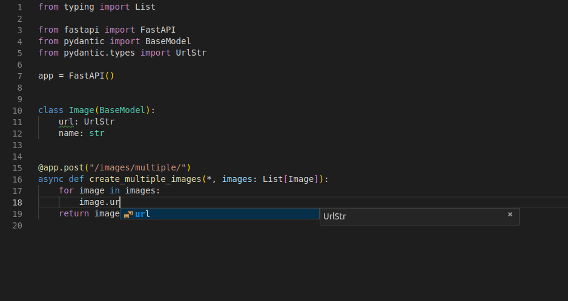

# 9_请求体-嵌套模型

使用 FastAPI，我们可以定义、校验、记录文档并使用任意深度嵌套的模型（感谢 Pydantic）。

---

## 1. List字段：

可以将一个属性定义为拥有子元素的类型。例如 Python list：
```python
from fastapi import FastAPI
from pydantic import BaseModel

app = FastAPI()


class Item(BaseModel):
    name: str
    description: str | None = None
    price: float
    tax: float | None = None
    tags: list = []  # 定义为Python列表


@app.put("/items/{item_id}")
async def update_item(item_id: int, item: Item):
    results = {"item_id": item_id, "item": item}
    return results
```
这将使`tags`成为一个由元素组成的列表。不过这里没有声明其每个元素的类型。

---

## 2. 带类型参数的List字段：

在python3.6-3.8，我们可以使用 typing 模块中的 `List`：
```python
from typing import List, Union

from fastapi import FastAPI
from pydantic import BaseModel

app = FastAPI()


class Item(BaseModel):
    name: str
    description: Union[str, None] = None
    price: float
    tax: Union[float, None] = None
    tags: List[str] = []  # 声明列表及其元素类型


@app.put("/items/{item_id}")
async def update_item(item_id: int, item: Item):
    results = {"item_id": item_id, "item": item}
    return results
```

在python3.9+ 我们可以使用Python的标准 `list` 来声明子元素类型：
```python
class Item(BaseModel):
    name: str
    description: Union[str, None] = None
    price: float
    tax: Union[float, None] = None
    tags: list[str] = []  # 声明列表及其元素类型
```

### 声明带类型参数的列表：

为了带有类型参数（内部类型）的类型，如 `list`、`dict`、`tuple`：

- 如果使用的python版本小于3.9，则需要从 `typing` 模块中调用对应的类型；
- 通过中括号`[]` 传递内部类型作为类型参数。

在python3.9+ 中：
```python
my_list: list[str]
```

在Python3.6-3.8中：
```python
from typing import List

my_list: List[str]
```

这些都是Python用于类型声明的标准语法。对具有子类型的模型属性也使用相同的标准语法。

因此，在我们的示例中，可以将 `tags` 明确表示为一个 字符串列表：

python 3.10：
```python
from fastapi import FastAPI
from pydantic import BaseModel

app = FastAPI()


class Item(BaseModel):
    name: str
    description: str | None = None
    price: float
    tax: float | None = None
    tags: list[str] = []  # 字符串列表


@app.put("/items/{item_id}")
async def update_item(item_id: int, item: Item):
    results = {"item_id": item_id, "item": item}
    return results
```

---

## 3. Set类型：

但是我们随后考虑了以下，意识到tag不应该重复，他们很大可能会是唯一的字符串。

所以我们可以使用Python中的 set 类型来保存唯一元素的 tags 字段。

python 3.10:
```python
class Item(BaseModel):
    name: str
    description: str | None = None
    price: float
    tax: float | None = None
    tags: set[str] = set()
```

python 3.6:
```python
from typing import Set, Union
...
class Item(BaseModel):
    name: str
    description: Union[str, None] = None
    price: float
    tax: Union[float, None] = None
    tags: Set[str] = set()
```

这样，即使我们收到带有重复数据的请求，这些数据也会被转换为一组唯一项。

而且，每当你输出该数据时，即使源数据有重复，它们也将作为一组唯一项输出。

并且还会被相应地标注 / 记录文档。

---

## 4. 嵌套模型：

Pydantic 模型的每个属性都带有类型。但是，这个类型本身也可以是另一个 Pydantic 模型。

因此，我们可以声明拥有特定属性名称、类型和校验的深度嵌套的 JSON 对象。

上述这些都可以任意的嵌套。

### 4.1 定义子模型：

我们现在定义一个 `Image` 模型：
```python
from pydantic import BaseModel

class Image(BaseModel):
    url: str
    name: str
```

### 4.2 使用子模型作为类型：

然后将 `Image` 作为 `Item` 模型的一个属性：

```python
class Item(BaseModel):
    name: str
    description: str | None = None
    price: float
    tax: float | None = None
    tags: set[str] = set()
    image: Image | None = None  # 使用Image模型为属性
```

这样，FastAPI所期望的请求体内容就像下面这样：
```json
{
    "name": "Foo",
    "description": "The pretender",
    "price": 42.0,
    "tax": 3.2,
    "tags": ["rock", "metal", "bar"],
    "image": {
        "url": "http://example.com/baz.jpg",
        "name": "The Foo live"
    }
}
```

Again, 仅仅通过这样声明，我们又可以得到FastAPI提供的：
- 编辑器对被嵌入模型的支持（自动补全等）
- 数据转换
- 数据校验
- 自动生成API文档

---

## 5. 特殊的类型和校验：

除了普通的单一值类型（如 `str`、`int`、`float` 等）外，还可以使用从 `str` 继承的更复杂的单一值类型。

要了解所有的可用选项，请查看关于 [Pydantic's exotic types](https://pydantic-docs.helpmanual.io/usage/types/#pydantic-types) 的文档。我们将在下一章节中看到一些示例。

例如，在 `Image` 模型中我们有一个 `url` 字段，我们可以将其声明为 Pydantic 中的 `HttpUrl` 而不是 `str`：
```python
from pydantic import BaseModel, HttpUrl

class Image(BaseModel):
    url: HttpUrl
    name: str
```
该字符串将会被检查是否为有效的URL，并在JSON Schema/OpenAPI 文东中记录。

---

## 6.带有子模型列表的属性：

我们还可以将Pydantic 模型用作 `list`、`set`等容器的子类型：
```python
from pydantic import BaseModel, HttpUrl

class Image(BaseModel):
    url: HttpUrl
    name: str

class Item(BaseModel):
    name: str
    description: str | None = None
    price: float
    tax: float | None = None
    tags: set[str] = set()
    images: list[Image] | None = None  # Image模型列表
```

这将需要（转换、验证、文档等）一个JSON体，如：
```json
{
    "name": "Foo",
    "description": "The pretender",
    "price": 42.0,
    "tax": 3.2,
    "tags": [
        "rock",
        "metal",
        "bar"
    ],
    "images": [
        {
            "url": "http://example.com/baz.jpg",
            "name": "The Foo live"
        },
        {
            "url": "http://example.com/dave.jpg",
            "name": "The Baz"
        }
    ]
}
```

---

## 7. 深度嵌套模型：

我们可以定义任意深度的嵌套模型：

```python
from pydantic import BaseModel, HttpUrl

class Image(BaseModel):
    url: HttpUrl
    name: str

class Item(BaseModel):
    name: str
    description: str | None = None
    price: float
    tax: float | None = None
    tags: set[str] = set()
    images: list[Image] | None = None  # 一层嵌套

class Offer(BaseModel):
    name: str
    description: str | None = None
    price: float
    items: list[Item]  # 两层嵌套
```

---

## 8. 纯列表请求体：

如过期望JSON请求体的最外层是一个JSON `array`（即Python `list`），则可以在路径操作函数的参数中声明此类型，就像声明Pydantic模型一样：
```python
images: list[Image]
```
即：
```python
from fastapi import FastAPI
from pydantic import BaseModel, HttpUrl

app = FastAPI()


class Image(BaseModel):
    url: HttpUrl
    name: str


@app.post("/images/multiple/")
async def create_multiple_images(images: list[Image]):  # 声明请求体images是一个列表
    return images
```
这时，FastAPI期望的请求体JSON内容类似下面这样, 不必使用images键：
```json
[
  {
    "url": "http://example.com/baz.jpg",
    "name": "The Foo live"
  },
  {
    "url": "http://example.com/dave.jpg",
    "name": "The Baz"
  }
]
```

---

## 9. 无处不在的编辑器支持：

你可以随处获得编辑器支持，即使是列表中的元素：


如果你直接使用 `dict` 接收请求体而不是 Pydantic模型，那么将无法获得这种编辑器支持。

不过我们根本不必担心这两者，传入的字典会被自动转换，我们的输出也会被自动转换为 JSON。

---

## 10. 任意 dict 构成的请求体：

还可以将主体声明为具有某些类型的键和其他类型的值的`dict`。

无需事先知道有效的 字段/属性 名称是什么（Pydantic模型就是这样）。若我们想要接收事先不知道的键keys，这将非常有用。

其他有用的场景是当我们想要接收其他类型的键（JSON的key默认是`str`类型的）时，例如 `int`。

在下面的例子中，我们将接受任意键为 `int` 类型并且值为 `float` 类型的 dict：
```python
from fastapi import FastAPI

app = FastAPI()


@app.post("/index-weights/")
async def create_index_weights(weights: dict[int, float]):
    return weights
```

> 请记住 JSON 仅支持将 `str` 作为键。但是 Pydantic 具有自动转换数据的功能。
>
> 这意味着，即使你的 API 客户端只能将字符串作为键发送，只要这些字符串内容仅包含整数，Pydantic 就会对其进行转换并校验。
>
>然后你接收的名为 `weights` 的 dict 实际上将具有 `int` 类型的键和 `float` 类型的值。

---

## 总结：

使用 FastAPI 可以拥有 Pydantic 模型提供的极高灵活性，同时保持代码的简单、简短和优雅。

而且还具有下列好处：

- 编辑器支持（处处皆可自动补全！）
- 数据转换（也被称为解析/序列化）
- 数据校验
- 模式文档
- 自动生成的文档